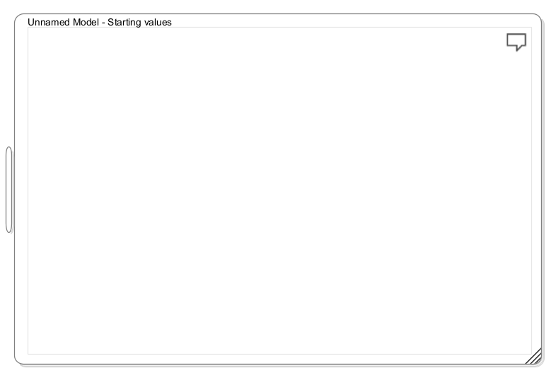
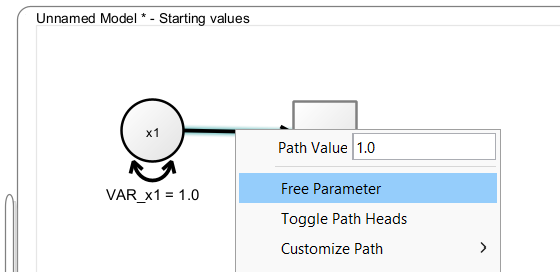
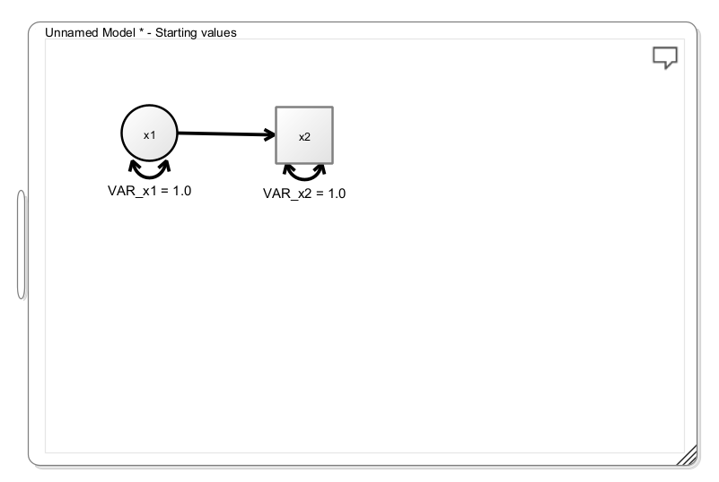
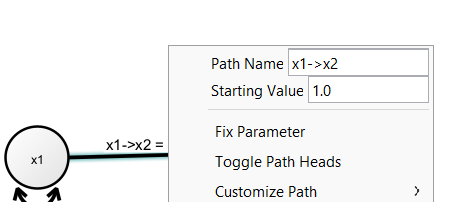
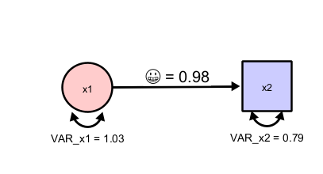
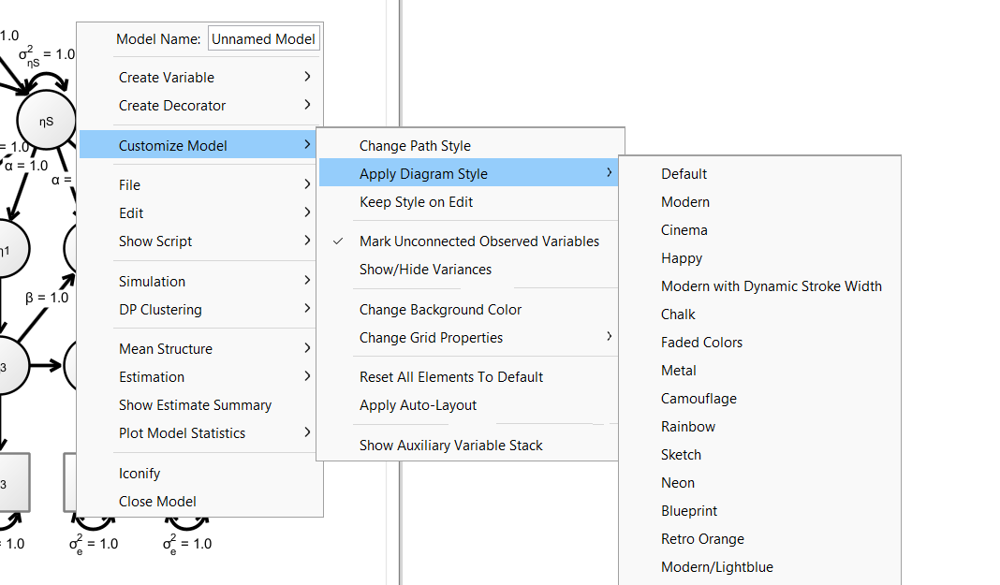
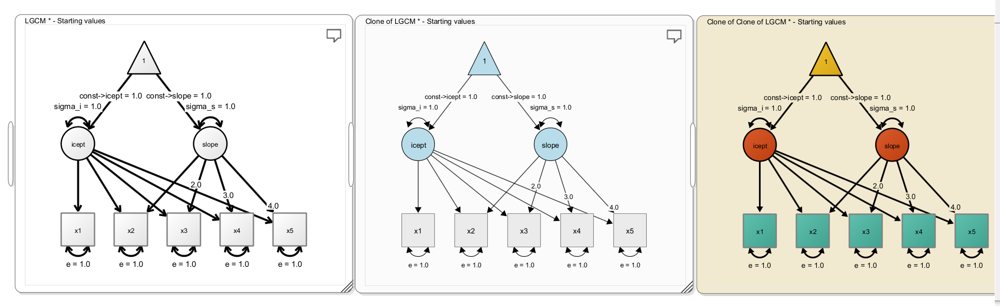
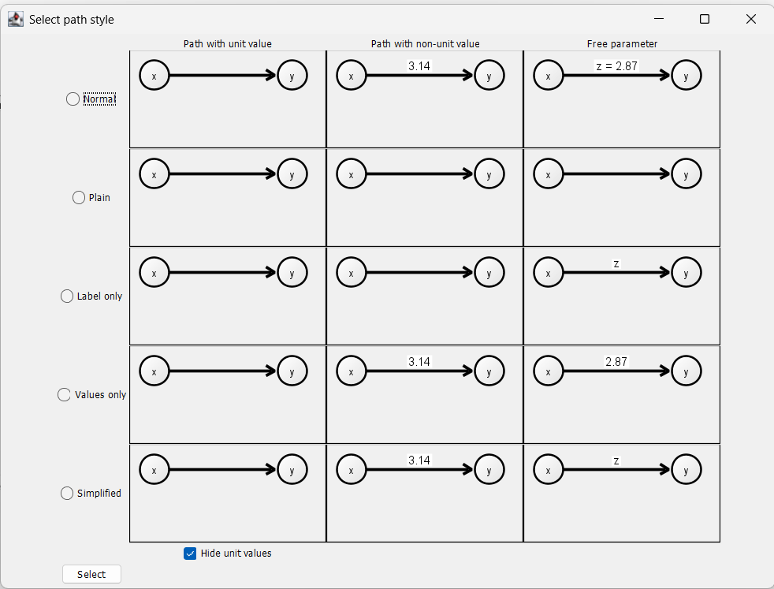

## Basic Modeling

To create a model, either right-click on the empty desktop and select "Create new Model -\> Create Empty Model" or double-click on the desktop. This creates an empty model view

You can now add variables, by either right-clicking on the empty view and selecting "Create Variable". Then you can either add a latent variable (depicted as a circle), an observed variable (depicted as a rectangle), a constant variable (depicted as a triangle). Beyond standard RAM notation, you can also use XRAM notation, in which you can add a multiplication node that allows you to model products of variables [@boker2023products]. This allows models including latent interactions. As a short-cut, you can simply double-click on an empty space in the model, to create a latent variable or double-click while holding down the SHIFT-key to add an observed variable.

To add a path between two variables, press the right mouse button on a variable, hold it down while dragging the path on to the target variable, then release the mouse button. This creates a regression path with a value fixed to "1" between the variables. When you hold down SHIFT while doing so, you create a covariance path. Right-click the path and select "Free Parameter" if you want this path to be freely estimated.

Try to add a latent and an observed variable and connect them with a path from the latent to the observed variable, and your model should look like this:

## Means

As long as no means are modeled explicitly, Onyx only models the variances and covariances of a dataset. Means are modeled by adding constant values to the path diagram (shown as triangles with value "1"). A path from a constant value to a variable represents the mean of that variable. Once a mean triangle is added to the path diagram, Onyx switches to explicit mean modeling which incorporates mean parameters for all variables.

## Changing Visuals

Onyx has a variety of options to adjust the appearance of the graph. Right-click on a node and choose "Customize Variable" to explore various options to adjust font size, line colors, fill colors, etc. The same is possible if you choose "Customize Path" when you right-click on a path.

## Renaming Parameters

If you free a parameter on a path (representing either a variance, covariance, a regression, or a mean), you can change the name of the parameter by right-clicking on the path and then changing the "Path Name". By default, these parameters are named based on the adjacent variables but you can choose your own name here.

Note that Onyx has Unicode support, that is, you can directly use unicode characters such as letters from the greek alphabet. Thus, it would even be possible to use emojis as parameter labels even though I do not recommend that:

Onyx further supports a very limited subset of LaTeX commands to render parameter labels. This pseudo LaTeX input is triggered by starting labels with a dollar sign. This pseudo input supports lowercase and uppercase greek letters, as well as subscript and superscripts. Here are some examples that are valid parameter names in Onyx:

| Input               | Output            |
|---------------------|-------------------|
| \\\\alpha           | $\alpha$          |
| \\\\beta\^2         | $\beta^2$         |
| \\\\gamma\_{person} | $\gamma_{person}$ |
| \\\\Omega\^2_i      | $\Omega^2_i$      |
|                     |                   |

## Diagram Styles

Onyx ships some pre-made styles for your graphs. Choose "Customize Model -\> Apply Diagram Style" and then choose from the available choices. Certainly, not all of them are useful for scientific communication but you may want to start with Modern or Modern/Lightblue. Further, you may want to choose "Keep Style on Edit", which continues to automatically apply the chosen style to newly added variables or paths in the diagram (otherwise, they are added using the default style).

Here are three examples of styles:

You can quickly iterate through the available styles in the actively selected model by pressing CTRL+L (or CMD+L on a Mac).

## Path Styles

By default, Onyx shows path with a value fixed to one without any label. Paths that have a value fixed but different than one are shown with the value as label. Freely estimated parameters are shown with both their label and their value (e.g., "z = 2.87"). You can also choose different path styles by right-clicking on a model, then selecting "Customize Model -\> Change Path Style". This opens the following window in which you can select among several alternative options. In particular, the option "Simplified" may be useful to create figures for manuscripts.

## Copy & Paste

Onyx supports copy&paste in diagrams. You can select a set of nodes, right-click the mouse and then select "Edit -\> Copy" (or press CTRL+C / CMD+C), which copies all selected nodes and all paths between them to the clipboard. If you select "Edit -\> Paste and Rename" (or press CTRL+V / CMD + V), a copy of these nodes and paths is inserted. Note that all parameter and variable names are automatically renamed to be different from the original variables and paths; otherwise they would be treated as being constrained to identity. If you prefer that choose "Edit -\> Paste" to insert exact copies without renaming. If you want to select the entire diagram to copy, press CTRL+A / CMD+A to select all variables before copying and pasting.

## Wizards

Onyx ships a small set of wizards to create standard models. These dialogs help you to create, for example, simple factor models, linear latent growth curve models, or dual change score models. Right-click the empty desktop and select "Create new model" to find a selection of the wizards. By selecting one of the wizards, a dialog will open that allows you customize some basic settings of the model (e.g., parameter names or other properties).

## Exercises

-   Create a factor model with one latent factors, four observed variables, residual variances for each factor, a latent factor variance, and factor loadings; fix the first factor loading at "1" and let the others be freely estimated; also freely estimate all residual variances; rename the observed variables to "item1", "item2", ...; rename the factor to "factor", rename the factor loadings to lambda1, lambda2, ... but use greek letters.
-   Apply diagram styles (CTRL+L / CMD + L; press multiple times) and then make your own modifications
-   Export the diagram as image file
-   Copy the entire factor model and paste it below. Select the original model and flip it vertically (using the short-cut CTRL+F / CMD+F), such that the latent factors are facing each other; then draw a covariance between the two latent factors and give it a blue color
