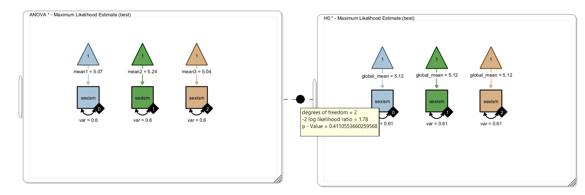
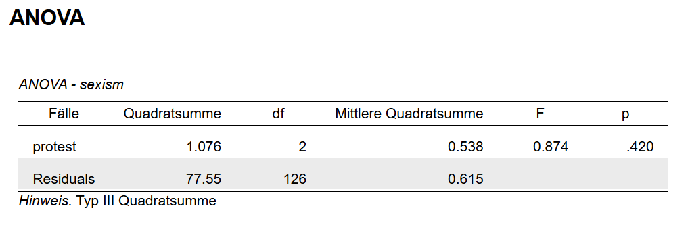

## Analysis of Variance in SEM

Analysis of Variance (ANOVA) is a test of differences in the means of a normally distributed variable across groups. We can implement this in a SEM in Onyx by representing each group with an observed variable representing the normal distribution in that group; that is, each variable needs a variance and a mean parameter. A grouping indicator (see Chapter: Multi-group models) can be used to assign each variable to a group. By cloning this model, wen can generate a model representing a null hypothesis (e.g., of equal means across groups) and perform a likelihood-ratio test (see Chapter: Model comparison) to make a statistical decision.

## Challenge

We use the dataset from the sexism protest study by @garcia2010women. From the description of the dataset in the psych R package:

> Garcia, Schmitt, Branscombe, and Ellemers (2010) report data for 129 subjects on the effects of perceived sexism on anger and liking of women's reactions to ingroup members who protest discrimination.
>
> \[...\]
>
> A data frame with 129 observations on the following 6 variables.
>
> `protest`
>
> :   0 = no protest, 1 = Individual Protest, 2 = Collective Protest
>
> `sexism`
>
> :   Means of an 8 item Modern Sexism Scale.
>
> `anger`
>
> :   Anger towards the target of discrimination. “I feel angry towards Catherine".
>
>     \[...\]
>
>     The reaction of women to women who protest discriminatory treatment was examined in an experiment reported by Garcia et al. (2010). 129 women were given a description of sex discrimination in the workplace (a male lawyer was promoted over a clearly more qualified female lawyer). Subjects then read that the target lawyer felt that the decision was unfair. Subjects were then randomly assigned to three conditions: Control (no protest), Individual Protest (“They are treating me unfairly") , or Collective Protest (“The firm is is treating women unfairly").
>
>     Participants were then asked how much they liked the target (liking), how angry they were to the target (anger) and to evaluate the appropriateness of the target's response (respappr).

## Tasks

1.  Load the dataset Garcia.csv

2.  Specify an observed-only ANOVA model with three groups to test whether the sexism ratings differed across the three experimental (protest) groups.

3.  Specify a null model, in which there are no mean differences

4.  Use model comparison to decide between those models; is there a significant difference between groups?

5.  Compare your results to ANOVA results from a different program (e.g., R or JASP); what is the difference?

6.  Should variances be set equal across groups or not? What choice is most similar to classic ANOVA?

## Solution

We specify a model with three copies of the outcome variable that each have a different grouping indicator to filter out only the cases of the respective group. Since group was coded 0,1, and 2, these are the values of the grouping indicators. Each variable has a mean (path from the triangle) and a variance. The variances are assumed to be identical (homoscedasticity assumption in ANOVA). We compare against a null model in which all means are assumed to be equal



### Solution in R

```{r eval=TRUE, echo=FALSE}
library(psych)
dat <- psych::Garcia
write.csv(dat, file = "data/Garcia.csv")

```

```{r eval=TRUE, echo=TRUE}

summary(aov(sexism ~ factor(protest), psych::Garcia))
```

### Solution in JASP



### Summary

R and JASP both perform a classic ANOVA assuming normality within the groups and equality of variances across the groups. They both compute the exact F-statistic.

In the SEM solution presented here, we also assume normality within groups and equality of variances (even though it is easy to remove this constraint). Onyx computes an asymptotic Chi-Square-statistic. That is, asymptotically the results are the same but may differ in small to moderate sample sizes.

All three approaches yield a non-significant result, that is, there is no evidence that sexism ratings differed across protest groups.

```{r echo=FALSE}
mod<-lavaan::lavaan(model="sexism~~c(var,var,var)*sexism; sexism~1", data=dat,group="protest")
modh0<-lavaan::lavaan(model="sexism~~c(var,var,var)*sexism; sexism~c(m,m,m)*1", data=dat,group="protest")

lavaan::parTable(mod)
lavaan::parTable(modh0)

lavaan::fitMeasures(mod)
lavaan::fitMeasures(modh0)

lavaan::lavTestLRT(mod, modh0)
```

## References
