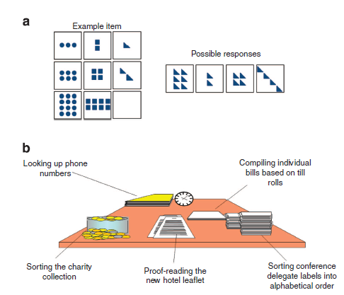
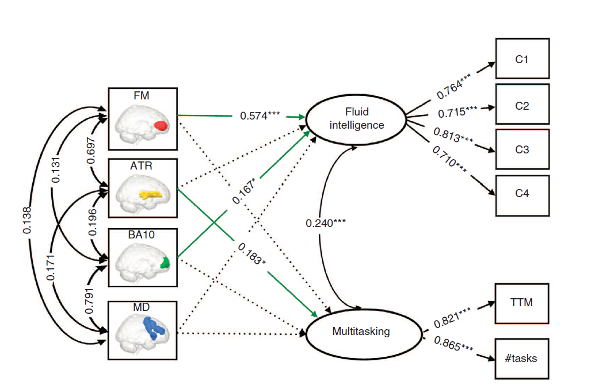
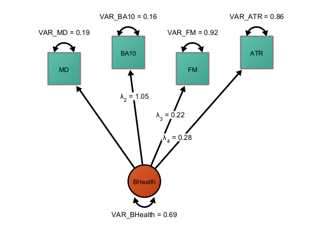
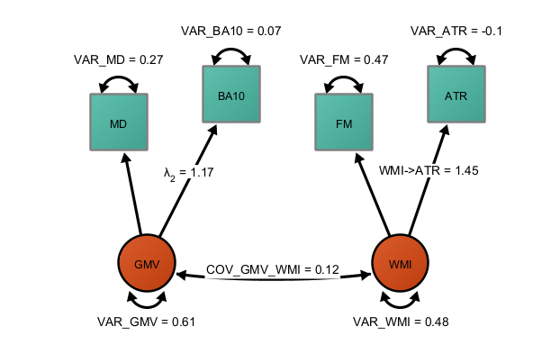
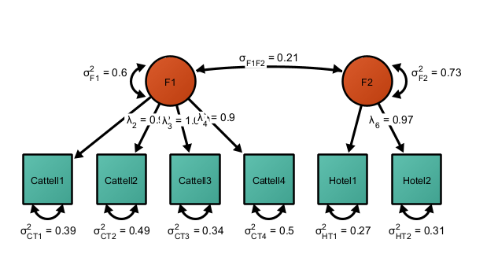
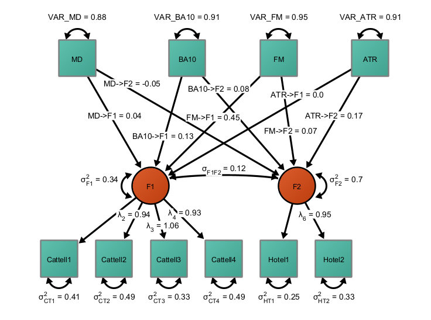

# Age-related differences in in fluid intelligence and multitasking and their correlations with gray-matter and white-matter volume

In this exercise, we will reproduce an  published SEM analysis by @kievit2014distinct. From their study:

> We focus on four neural properties selected based on the current
> literature—(see Methods), two involving grey matter volume (GMV;
> Brodmann Area 10 (BA10) and the Multiple Demand (MD) System), and two
> involving WMI (the Forceps Minor (FM) and the Anterior Thalamic
> Radiations (ATR)). Fitting a series of structural equation models, we
> show that multitasking and fluid intelligence are distinct cognitive
> abilities that show diverging age-related differences.

In their study, they assessed two behavioral performance measures. From
their study:

> We assess fluid intelligence using the Cattell Culture Fair Test,
> consisting of pencil-and-paper subtests that yield four summary scores
> (series completions, odd-one-out, matrices and topology) used in
> further modelling. \[...\] This consisted of four subtests yielding a
> sum score each. In contrast to the Cattell test of fluid intelligence,
> the Hotel test simulates a hotel work environment and measures the
> ability to distribute performance across multiple tasks, which we will
> refer to from here on as multitasking.

> Ageing is characterized by declines on a variety of cognitive
> measures. These declines are often attributed to a general, unitary
> underlying cause, such as a reduction in executive function owing to
> atrophy of the prefrontal cortex. However, age-related changes are
> likely multifactorial, and the relationship between neural changes and
> cognitive measures is not well-understood. Here we address this in a
> large (N=567), population-based sample drawn from the Cambridge Centre
> for Ageing and Neuroscience (Cam-CAN) data. We relate fluid
> intelligence and multitasking to multiple brain measures, including
> grey matter in various prefrontal regions and white matter integrity
> connecting those regions.

Our final goal is to reproduce their final SEM to explain individual
differences in the two cognitive facets using the four brain measures of
interest:

# Exercise

1.  Load the dataset "ncomms.dat", which contains the variances and
    covariances as reported by @kievit2014distinct.
2.  Create a measurement model for cognition using only the behavioral
    variables. What model fits better? A model with a single performance
    factor across all six tests? Or two correlated latent factors, one
    fluid intelligence factor for the Cattell items and one multitasking
    factor for the Hotel test items?
3.  Create a measurement model for the brain? Does a single factor
    across gray matter volume and white matter volume represent the
    observed data well? If not, is it possible to represent the data
    using two correlated factors? A gray matter volume factor with two
    indicators and a white matter factor with two indicators? If not,
    what else can we do?
4.  Fuse both models in one model and use whatever items or factors you
    chose in your measurement models, such that the brain variables
    predict behavior. Freely estimate those parameters. What can we
    learn?
5.  Discuss the results (e.g., directionality and size of the effects)
6.  Test whether the effect of FM->MT and ATR->MT is different.

# Solution

