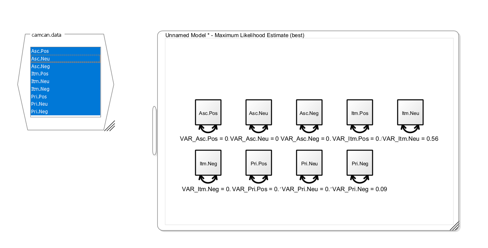
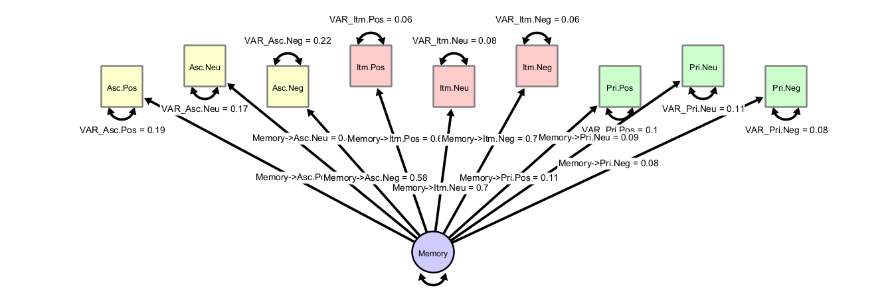
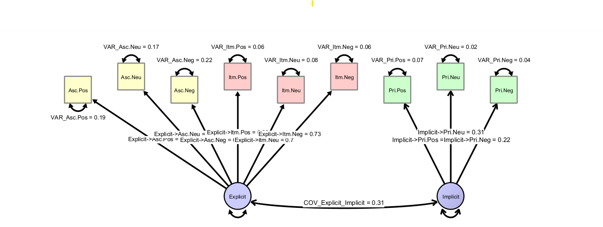
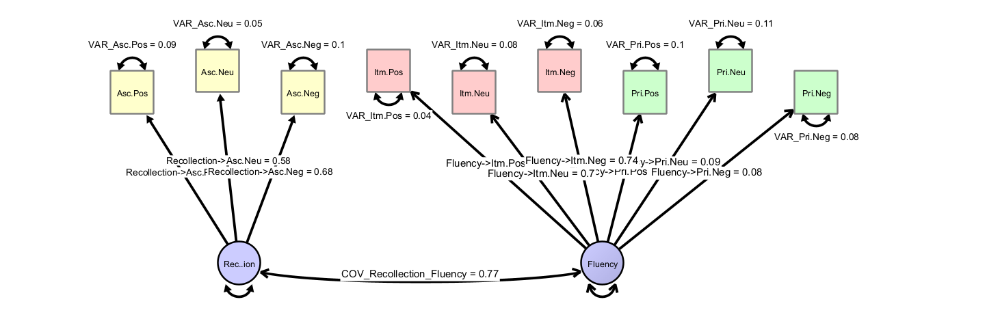
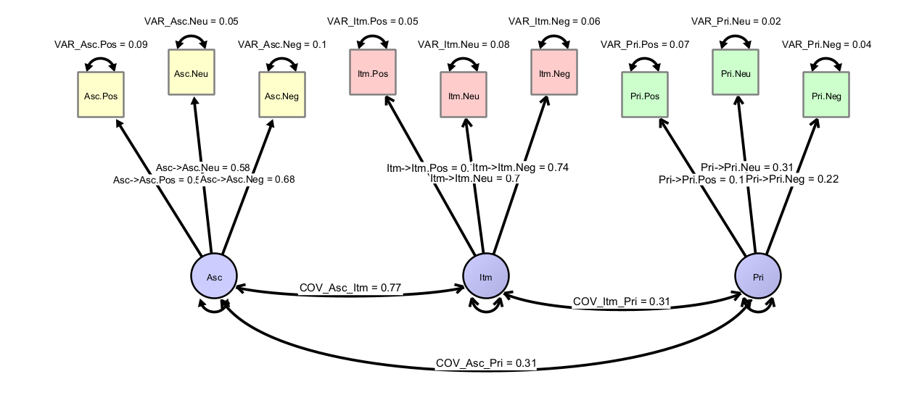
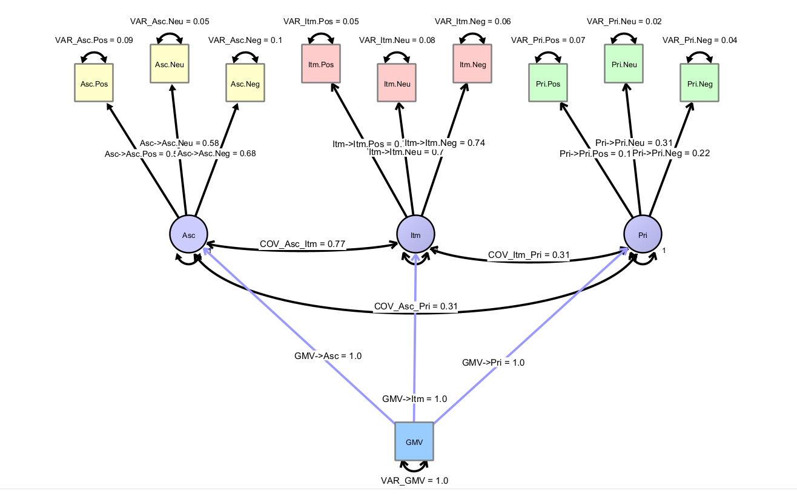

## Challenge: Multiple determinants of lifespan memory differences

In this exercise, we will reproduce results reported by [@henson2016multiple]. In their study, they speculate on different theories of memory. Here, we use SEM to test different measurement models representing the different theories of memory. Items are 9 memory scores (3 valences and 3 tests, fully crossed). The tests tap into associative memory, item memory, and visual priming. Valences are positive, neutral, negative. The data is based on the reported covariances of the item d' values across the nine tests. @henson2016multiple write in their introduction:

> Human memory is often claimed to consist of different systems, supported by distinct brain regions^[1](https://pmc.ncbi.nlm.nih.gov/articles/PMC5013267/#b1)^,^[2](https://pmc.ncbi.nlm.nih.gov/articles/PMC5013267/#b2)^,^[3](https://pmc.ncbi.nlm.nih.gov/articles/PMC5013267/#b3)^. However, the precise fractionation of these memory systems is a matter of continuing debate^[4](https://pmc.ncbi.nlm.nih.gov/articles/PMC5013267/#b4)^,^[5](https://pmc.ncbi.nlm.nih.gov/articles/PMC5013267/#b5)^. 

In the following, they list a couple of different theories that postulate different structural models underlying the observed variances and covariances.

## Theories

Alternative theories for memory discussed are:

-   Theory #1 (Berry et al.)

A single factor drives memory performance across all tests and valences.

-   Theory #2 (Squire)

Two components drive memory performance, namely declarative (explicit) memory underlying associate and item memory, plus a procedural (implicit) system underlying priming.

-   Theory #3 (Gardiner et al., Yonelinas)

An alternative two-component model assumes a recollection factor underlies associate memory, and a fluency factor underlies item memory and priming.

(optional variant: item memory is driven by both recollection and fluency)

-   Theory #4

A three-component model predicts that each test is best described by an individual underlying component.

## Fast Model Creation

The data are provided in the file `camcan.data`, which contains the variances and covariances across the nine indicators measured in N=305 persons.

Note that the fastest way to start modeling is to load the data, select all variables in the loaded dataset and drag them onto the empty model panel. This way, all observed variables are created in the model, together with each a free parameter representing their variance, and they are directly linked to the dataset (for model fitting). Maximum likelihood-estimation directly starts and the values represent the maximum-likelihood estimates of the variances of each variable.



In order, to create a common factor, double-click on an empty space in the model view. A latent variable (shown as a circle) appears. Change the default name to "Memory". Now add the factor loadings. These are directed paths from the latent factor to each observed variable and make them freely estimated variables. Feel free to use the layout and graph settings to customize the appearance. Note that a factor model needs an identification constraint to identify the latent scale. To implement this, either fix the latent variance to one or fix one of the loadings to one. In the first case, the latent scale is identified such that it has unit variance; in the second case, it is identified to have the same unit of measurement as the item with the unit factor loading. Your graph should look somewhat like this:



Let us inspect the explained variance in each item. You can do this visually by giving the observed variables a fill color and then select "Customize Variable -> Select Fill Style -> Bokers R2" and each observed variable will be filled according to the level of explained variance. Or, you hover the mouse over a single, unselected observed variable. A popup window will appear, in which you can read off the $R^2$ value as estimate of explained variance. Using either way, we can already see that the priming variables are not well explained by the common factor. Further, we find these goodness-of-fit values:

```
RMSEA (classic)               : 0.288 
SRMR (covariances only)       : 0.142
CFI (to independent model)    : 0.73
```

What other models could explain these data better?

## Exercises

Exercise:

1\) Set up models representing the alternative theories, fit the models with the provided data (camcan.data) as described above and discuss the results.

2\) Inspect parameter estimates (e.g., check for problems like negative variances) and model fit statistics

3\) What model fits best?

4\) How could your final model incorporate predictors of behavior, e.g. grey matter volume estimates of some ROIs?

## Solution


This is the common factor model (Theory 1):


This is explicit and implicit memory (Theory 2):




This is the recollection and fluency factor (Theory 3):


And finally a model of three different factors:



### Model Comparison

For all models, inspect model fit (CFI, RMSEA, residuals) and also investigate the factor loading strengths as well as the explained variances across items. 

### Extension to Brain Variables

How would a model look like, which has a brain variable, which we would like to use to predict behavior with?


## References


