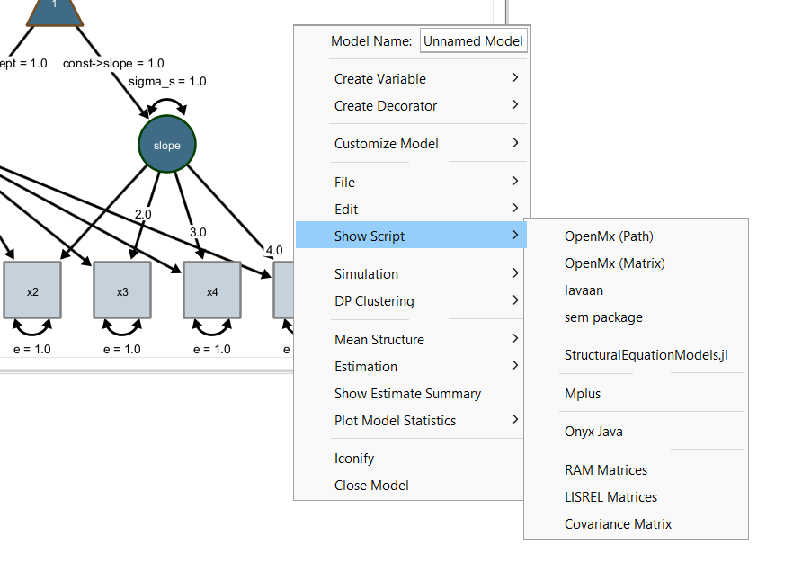
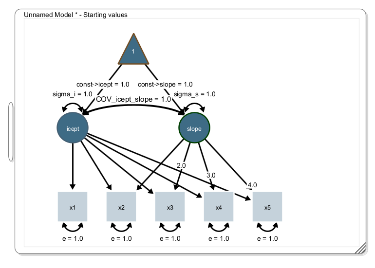
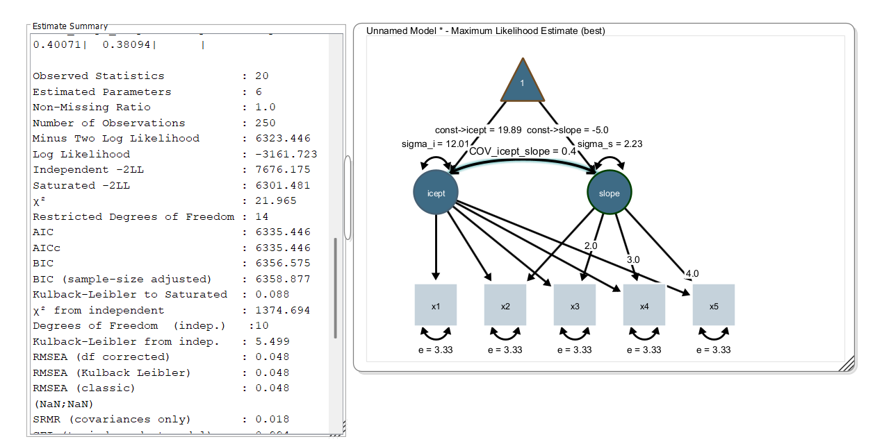

## Syntax Export

Onyx supports exports of models to syntax specifications of other languages. This way, Onyx can be used for graphical model specification and other programs can then be used if their more advanced features are needed for estimating models (e.g., other estimators or non-normally distributed variables, etc.). To view model syntax, right-click a model and choose "Show Script" and select a syntax of your choice. Importantly, this includes the widely used R packages OpenMx and lavaan but also commercial software such as Mplus:



Importantly, the model syntax view remains linked to the model, that is, if the model graph is changed (e.g., by adding or removing variables or paths in the path diagram), the model syntax is updated. Onyx highlights newly added code parts in yellow.

## Exercise

-   Create a linear latent growth curve model using the linear latent growth curve model wizard (right-click the desktop, select "Create new model -\> Create new LGCM"; make sure to estimate a covariance between intercept and slope (click the respective option in the dialog)

-   Don't forget to use some of the visual options to change the appearance of the diagram

-   Load the data "lgcm_simulated.csv" and obtain parameter estimates; inspect model fit

-   Open the model syntax view for lavaan

-   If you are familiar with lavaan and R: Copy the lavaan code to an R session; adapt the code to load the data file; estimate the model in lavaan; compare the results between Onyx and lavaan

## Solution

The path diagram should look like this (showing the starting values; not the parameter estimates):



Load the dataset, select all variables, right-click on the data view and click "send data to model". Model estimation starts and your parameter estimates and model fit statistics should look like this:


This is the lavaan model syntax as generated by Onyx:
```         

#
# This model specification was automatically generated by Onyx
#
library(lavaan);
modelData <- read.table(DATAFILENAME, header = TRUE) ;
 model<-"
   ! regressions 
   icept=~1.0*x1
   icept=~1.0*x2
   slope=~1.0*x2
   icept=~1.0*x3
   slope=~2.0*x3
   icept=~1.0*x4
   slope=~3.0*x4
   icept=~1.0*x5
   slope=~4.0*x5
   ! residuals, variances and covariances
   x1 ~~ e*x1
   x2 ~~ e*x2
   x3 ~~ e*x3
   x4 ~~ e*x4
   x5 ~~ e*x5
   icept ~~ sigma_i*icept
   slope ~~ sigma_s*slope
   icept ~~ COV_icept_slope*slope
   ! means
   icept ~ const__icept*1
   slope ~ const__slope*1
   x1 ~ 0.0*1
   x2 ~ 0.0*1
   x3 ~ 0.0*1
   x4 ~ 0.0*1
   x5 ~ 0.0*1
"
result<-lavaan(model, data=modelData, fixed.x=FALSE, missing="FIML")
summary(result, fit.measures=TRUE)
```

In this code, you only need to replace the placeholder "DATAFILENAME" with the path to a data file on your computer. Then, model estimation in R using the lavaan package yields:

```{r echo=FALSE, eval=TRUE}
#
# This model specification was automatically generated by Onyx
#
library(lavaan);
DATAFILENAME="data/lgcm-simulated.csv"
modelData <- read.table(DATAFILENAME, header = TRUE) ;
 model<-"
   ! regressions 
   icept=~1.0*x1
   icept=~1.0*x2
   slope=~1.0*x2
   icept=~1.0*x3
   slope=~2.0*x3
   icept=~1.0*x4
   slope=~3.0*x4
   icept=~1.0*x5
   slope=~4.0*x5
   ! residuals, variances and covariances
   x1 ~~ e*x1
   x2 ~~ e*x2
   x3 ~~ e*x3
   x4 ~~ e*x4
   x5 ~~ e*x5
   icept ~~ sigma_i*icept
   slope ~~ sigma_s*slope
   icept ~~ COV_icept_slope*slope
   ! means
   icept ~ const__icept*1
   slope ~ const__slope*1
   x1 ~ 0.0*1
   x2 ~ 0.0*1
   x3 ~ 0.0*1
   x4 ~ 0.0*1
   x5 ~ 0.0*1
"
result<-lavaan(model, data=modelData, fixed.x=FALSE, missing="FIML")
summary(result, fit.measures=TRUE)

```

As you can see, all parameter estimates and fit statistics are identical.
