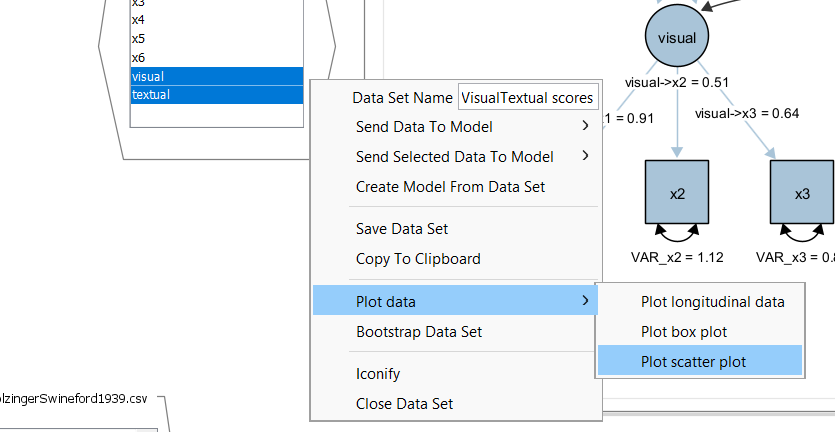
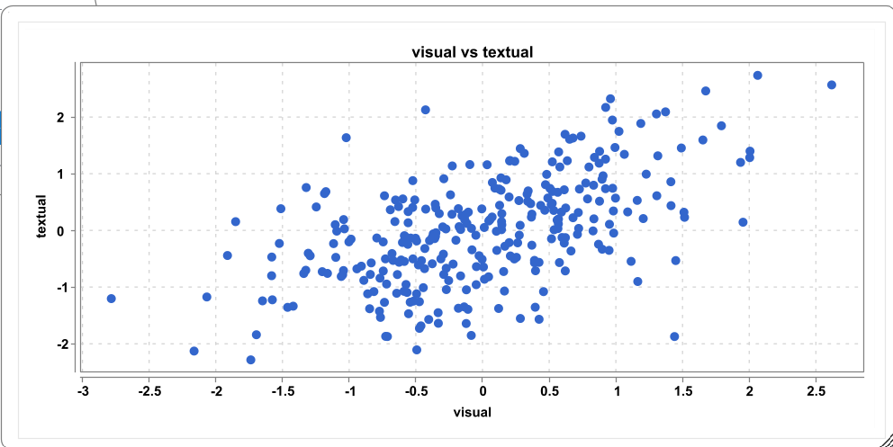

## Factor Scores

Factor score estimation is a post-estimation step in SEM that involves deriving individual-level scores on latent variables from the fitted model. Ideally, any kind of inference should be made using the SEM instead on estimated individual-level scores because the estimation introduces estimation error. For example, if one is interested in the correlation of two latent factors, this correlation should be modeled and model-based estimates should be used for the inference. Common approaches include regression (or “Thurstone”) scoring, Bartlett scoring, and empirical Bayes methods, each trading-off bias and efficiency. Importantly, factor scores are not uniquely determined—they depend on the chosen estimation method and model specification—so they should be interpreted as approximations rather than exact measurements of the latent constructs. In applied work, factor scores are often used for secondary analyses, such as predicting outcomes or classifying individuals, but their uncertainty and potential indeterminacy should always be taken into account.

## Factor-score estimation in Onyx

## Holzinger Swineford

From the description provided in the lavaan package:

> The classic Holzinger and Swineford (1939) dataset consists of mental ability test scores of seventh- and eighth-grade children from two different schools (Pasteur and Grant-White). In the original dataset (available in the MBESS package), there are scores for 26 tests. However, a smaller subset with 9 variables is more widely used in the literature (for example in Joreskog's 1969 paper, which also uses the 145 subjects from the Grant-White school only).

The commonly used factor model for these 9 variables consists of three latent variables each measured by three indicators:

-   a visual factor measured by three variables: x1, x2 and x3

-   a textual factor measured by three variables: x4, x5 and x6

-   a speed factor measured by three variables: x7, x8 and x9

## Exercise

1.  Load the dataset `HolzingerSwineford1939.csv`

2.  Create a latent factor model with the first six observed variables (x1 to x6); allow a correlation of the two latent factors; name the model "VisualTextual"

3.  Obtain factor scores of the two latent variables

4.  Plot a scatter plot of the estimated factor scores from the visual and textual factor. What do you see? How does this relate to the latent correlation between the two factors?

# Solution

First, create the latent factor model. It should look like this:

Next, obtain the factor score estimates -- this opens a new dataset including the estimated scores as new variables; the names correspond to the names of the latent factors. Then right-click on an empty space in the dataset view, select plot and then scatterplot:

This creates a scatterplot:

Here, we can see a positive correlation of medium size. This corresponds to the latent factor score correlation in the model. Note, however, that the model-based correlation is a better estimate (less biased and more precise) than estimating a correlation on the estimated factor scores.
