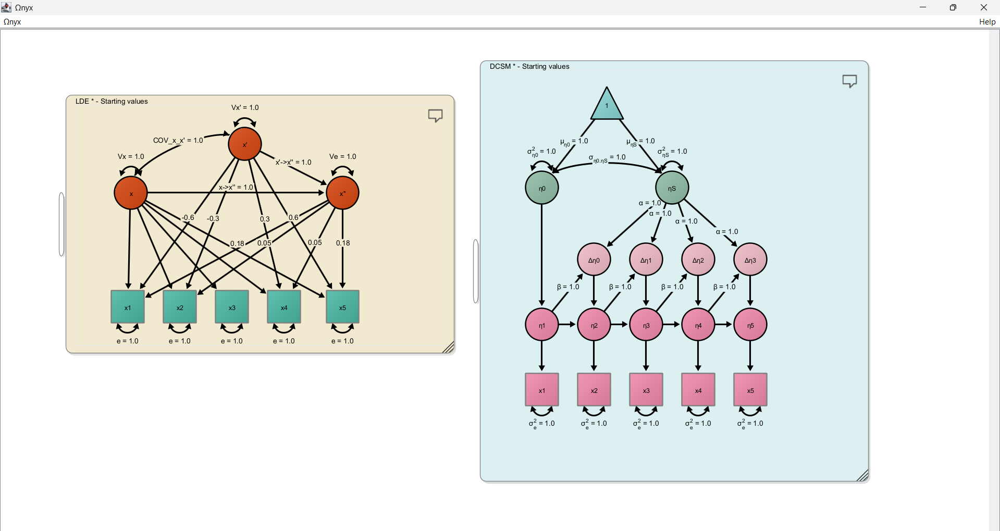

# Preface {.unnumbered}

This is a self-paced workshop for Onyx, a graphical user-interface for structural equation modeling.



This workshop is designed for researchers and students who are new to Onyx and already familiar with basic SEM concepts.

We assume that you are already familiar with:

- latent and observed variables,
- factor loadings and residual variances,
- model fit indices such as chi-square, RMSEA, CFI, and SRMR.

## What you will learn

The workshop covers practical Onyx workflows, including:

- creating path models,
- estimating and evaluating model fit,
- comparing nested models,
- working with multigroup models,
- exporting syntax to other SEM tools.

## Before you begin

Please make sure that:

1. Onyx is installed and opens normally on your machine.
2. You can load workshop data files from the `sem-workshop/data/` folder in the [github repository](https://github.com/brandmaier/lip2026-onyx-workshop/tree/main/sem-workshop/data) .
3. You are comfortable using right-click context menus (most Onyx actions are menu-driven).

If you are new to Onyx, start with **Introduction** and then **Basic Modeling** before moving on to the other chapters. These cover basic workflow elements in Onyx. Then proceed to the more advanced topics or do some of the challenges.

## Resources

```{r echo=FALSE, eval=TRUE}
library(qrcode)
primary_color <- "#090909"
secondary_color <- "#F2F6F5"
link1 = "https://brandmaier.github.io/lip2026-onyx-workshop/"
link2 = "https://github.com/brandmaier/lip2026-onyx-workshop/tree/main/sem-workshop/data"
generate_svg(qr_code(link1), here::here("img/", "qr_link1.svg"), foreground = secondary_color, background = primary_color, show = FALSE)
generate_svg(qr_code(link2), here::here("img/", "qr_link2.svg"), foreground = secondary_color, background = primary_color, show = FALSE)
```

The workshop can be found here:


[Workshop Website](https://brandmaier.github.io/lip2026-onyx-workshop/)

The resources (data files) can be found here:


[Data folder](https://github.com/brandmaier/lip2026-onyx-workshop/tree/main/sem-workshop/data)
