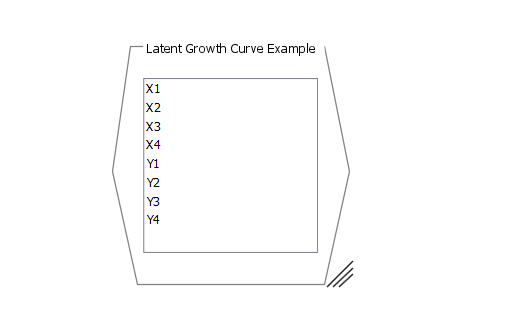
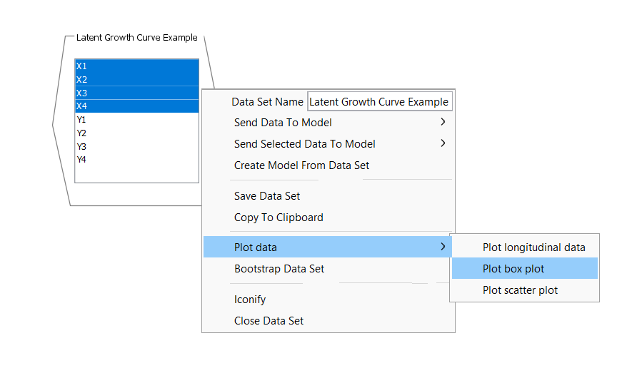
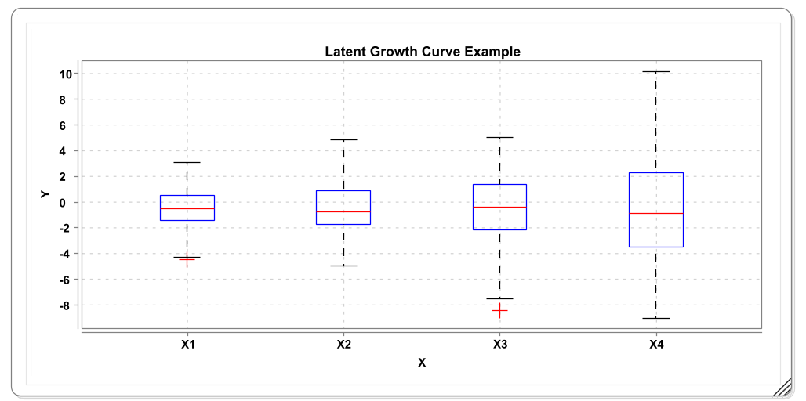
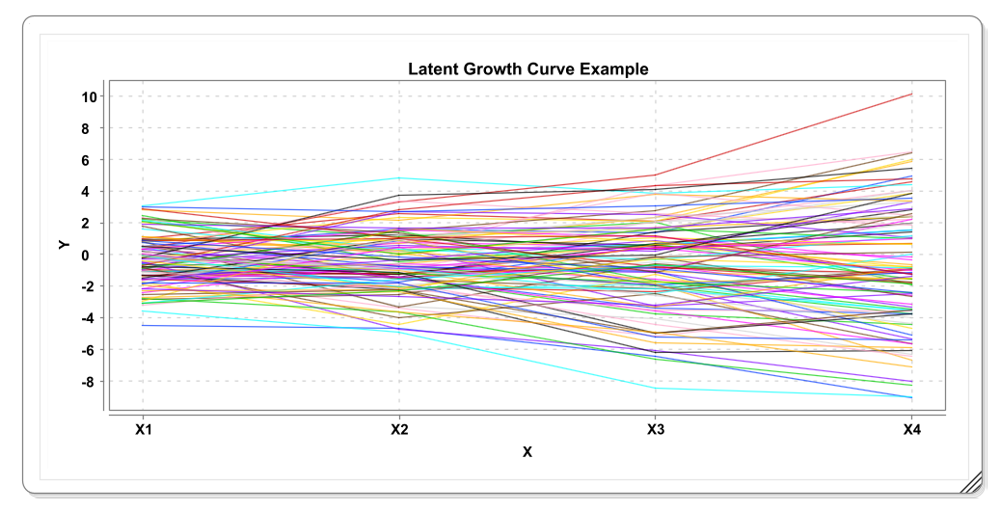
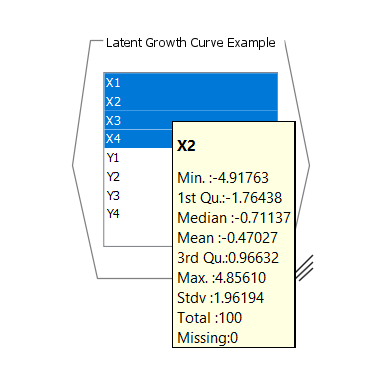
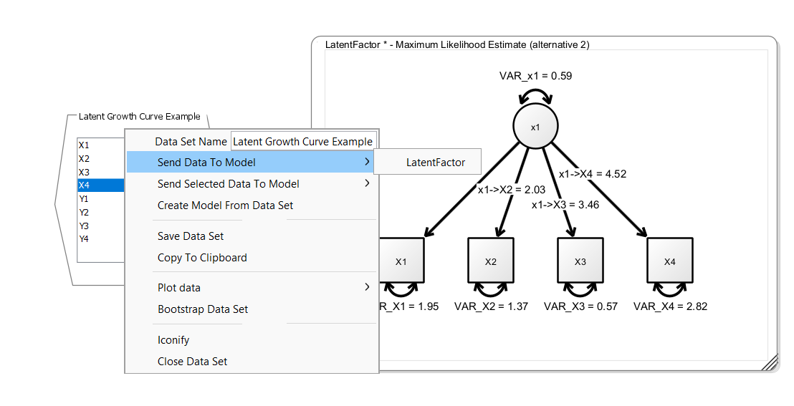

## Loading Data

Onyx supports loading of data from three types of data files, either delimted text files (most typically, the comma-separated value file or CSV), SPSS files, or text files that describe an observed covariance matrix. We recommend using CSV files as the most interoperable exchange format. To load a datafile, you can either right-click on the empty desktop and select "Load Model or Data". A file dialog will appear from which you can either choose a CSV file, an SPSS data file, or a text file with a covariance matrix. We also provide some toy datasets, which you can load from the same context menu by clicking "Load tutorial data" and then by selecting one of the four shipped datasets.

Datasets appear as hexagonal shaped data views:

The data view contains a list of all variables in the dataset. You can use some basic plotting functionality to look at these data. For example:

This will create a plot like this:

Also try out the other two plotting options. For example, the longitudinal plot:

You can also hover the mouse over a variable in the data view and a popup window will appear that contains basic statistics. It's a good way to check these statistics to see whether Onyx loaded the data correctly:

## Connecting Data and Models

To start model estimation, you need to connect all variables in a model with variables from a dataset. To do so, you can right-click on the data view, select "Send Data To Model" and then select the name of the model you want to connect the variables to. Note that Onyx depicts variables that are not yet connected with a light gray border color and once they are connected they get their regular border color. Once all variables in a model are connected to a variable, estimate in Onyx is started and once the estimation process converged, the resulting parameter estimates are directly shown in the Onyx model.

## Model Creation Shortcuts

The fastest way to start modeling is to simply drag and drop one or more selected variables from the data view to a model view. This will create new observed variables with matching names that are already connected to the data set.

## Exercise

1.  Load the tutorial dataset "Confirmatory Factor Example"

2.  Plot the data using boxplots and a scatterplot of x1 and x2

3.  Create an empty model, create variables with names matching those of the dataset (e.g., simply drag and drop the variables from the data view to the model view)

4.  Specify a common factor and see how Onyx refits the model as you modify the graph
