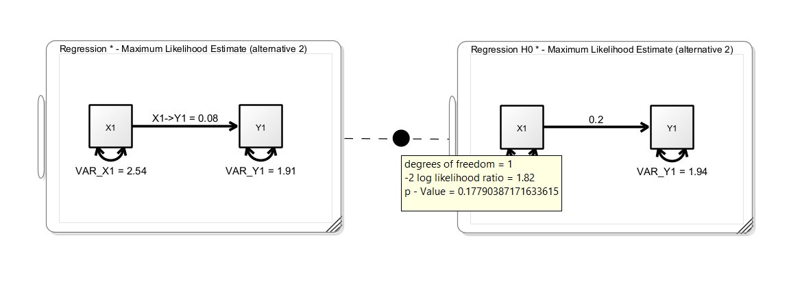
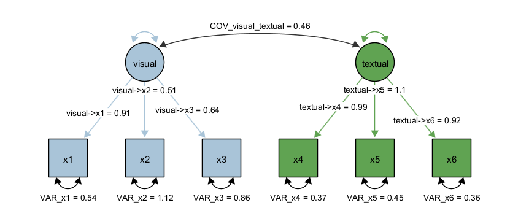
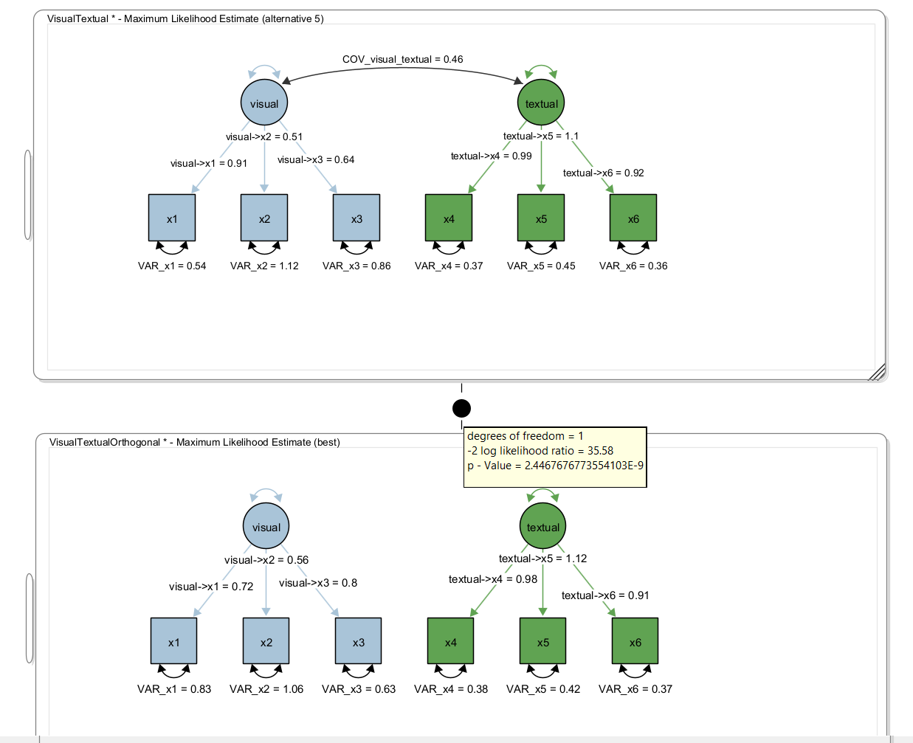

## Model Comparison

Model comparison in Structural Equation Modeling is a central technique for evaluating how well different theoretical specifications fit the observed data. In [Psychology]{.underline}, researchers often compare **nested models**, where one model is a constrained version of another (e.g., fixing certain parameters to zero or imposing equality constraints). This nesting allows for the use of **likelihood ratio tests (LRTs)**, which formally assess whether the more complex model provides a significantly better fit than the simpler one. By examining changes in model fit (typically via differences in chi-square statistics for nested models) researchers can determine whether added parameters meaningfully improve explanatory power or whether a more parsimonious model is sufficient. This approach is particularly useful for testing theoretical assumptions, such as whether specific pathways are necessary or whether constraints (e.g., equal effects across groups or time points, measurement invariance, additional predictors) are justified, thereby supporting more precise and theory-driven conclusions.

## Model Comparison using Chi-Square-Tests

Onyx supports model comparison for nested models based on the chi-square test. To compare two models, you can add a model comparison of two models that is represented as an edge between two models (similar to a path between two variables). The model comparison is created analogously to creating a path between two variables. Press the right mouse button on an empty space of one model, the mouse pointer onto the second model, and release the mouse button. A model comparison edge will appear between the two models – hovering the mouse over the circle will show a popup window with the results of the model comparison including the test statistics (-2 log likelihood ratio) and a p value:

In this example, we see a simple regression model (without means) on the left-hand side. The unstandarized regression coefficient is 0.08. The right-hand model is a clone of the left model with the regression coefficient fixed to 0.2; this corresponds to a null hypothesis that the true regression coefficient is 0.2. The p-value of the model comparison is not significant, thus we cannot reject the restricted null model. We did not find evidence that the true regression coefficient is different from 0.2.

## Comparing Non-Nested Models

Onyx performs a nesting test. If models are not nested, the likelihood ratio test is not applicable. In these instances, there are various heuristic approaches that are usually taken. By default, Onyx shows the difference in AIC values and shows which model is favored according to AIC. Other researchers prefer to compare CFI and RMSEA and choose the model which has better fit according to these criteria.

## Holzinger Swineford

From the description provided in the lavaan package:

> The classic Holzinger and Swineford (1939) dataset consists of mental ability test scores of seventh- and eighth-grade children from two different schools (Pasteur and Grant-White). In the original dataset (available in the `MBESS` package), there are scores for 26 tests. However, a smaller subset with 9 variables is more widely used in the literature (for example in Joreskog's 1969 paper, which also uses the 145 subjects from the Grant-White school only).

The commonly used factor model for these 9 variables consists of three latent variables each measured by three indicators:

-   a *visual* factor measured by three variables: `x1`, `x2` and `x3`

-   a *textual* factor measured by three variables: `x4`, `x5` and `x6`

-   a *speed* factor measured by three variables: `x7`, `x8` and `x9`

## Exercise

1.  Load the dataset `HolzingerSwineford1939.csv`

2.  Create a latent factor model with the first six observed variables (x1 to x6); allow a correlation of the two latent factors; name the model "VisualTextual"

3.  Make a copy of the model ("edit -\> clone model") and rename it to "VisualTextualIndependent"

4.  Modify the model "VisualTextualIndependent" by removing the correlation between the two latent factors

5.  Use a likelihood ratio test to compare the two models. Which model is favored? Is there evidence for a correlation of the textual and visual factor?

6.  Obtain latent variable factor scores and plot them in a scatterplot

## Solution

First, we load the dataset, we select variables x1 to x6 (e.g., by selecting x1, holding down the SHIFT key and then selecting x6 in the variable list of the dataset view). Next, we create two latent factors and draw the factor loadings. Last, we fix the latent variances to one and estimate all factor loadings freely; alternatively, we could fix one factor loading to one and estimate the latent variances freely. However, by fixing the latent variances to one, we can directly interpret the latent covariance as correlation. The path diagram should look like this:

Next, we clone the model (using Edit -\> Clone Model) and rename the cloned model. Then we right-click the covariance in the cloned model and select "Delete Path". Then, create a model comparisong edge between the two models. Hover the mouse over the filled circle of the model comparison edge and the result of the model comparison appears:

Here, we obtained a test statistic of 35.58 for the likelihood ratio test with one degree-of-freedom (because a single parameter was removed, ie., set to zero). The p value is \<0.001 and thus, the model with the extra parameter (ie., the covariance) significantly fits better than the model without the covariance.

