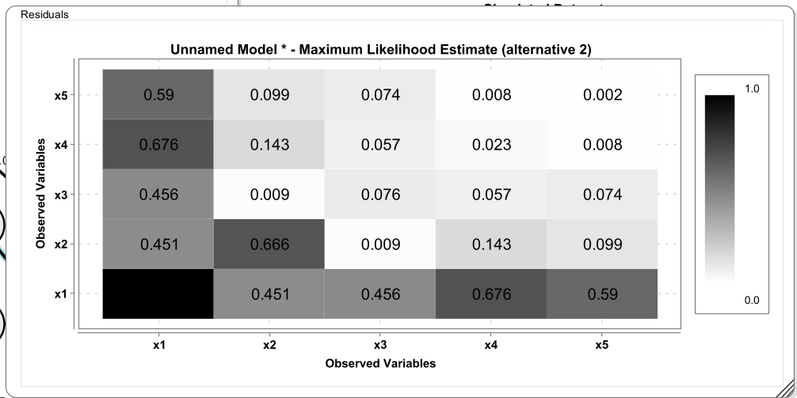
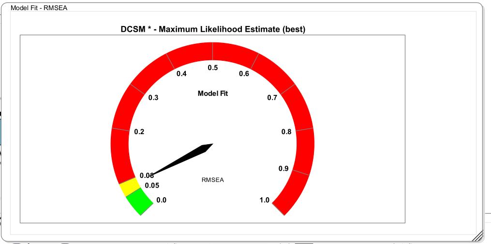
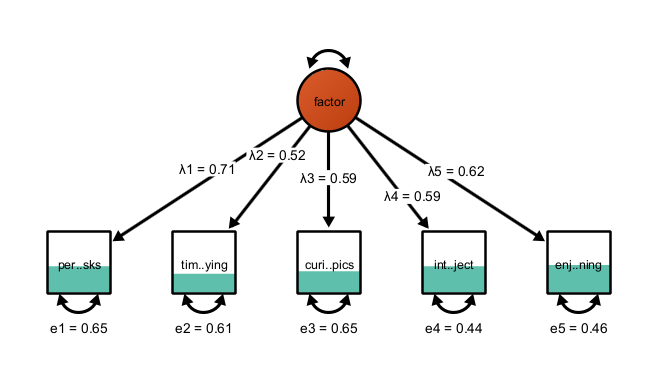
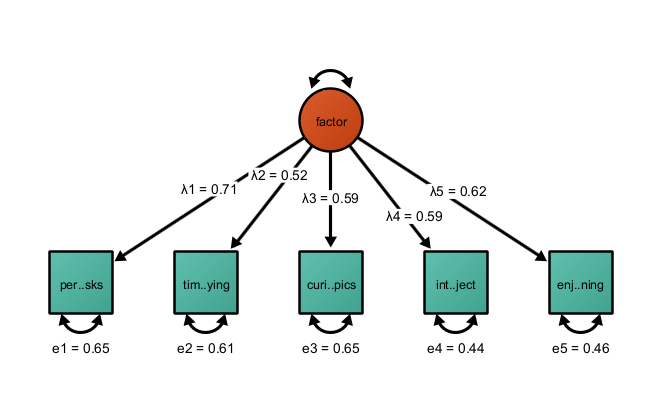
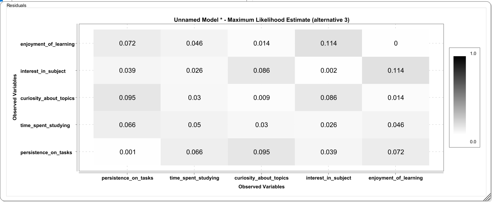

## Model Fit

In SEM, the fit function to obtain maximum likelihood estimates under multivariate normality of the observations and assuming no missing data is:

$$F_{\mathrm{ML}} = \log\lvert \boldsymbol{\Sigma}(\theta) \rvert 
+ \mathrm{tr}\left( \mathbf{S}\, \boldsymbol{\Sigma}(\theta)^{-1} \right) 
- \log\lvert \mathbf{S} \rvert - p$$
where $\Sigma$ is the model-implied covariance matrix and $S$ is the observed covariance matrix. This can be expanded to also include means.

Assuming $H_0$ that there is no misfit is true, the following test statistic has an asymptotic $\chi^2$ distribution

$$\chi^2 = (N - 1)\,F_{\mathrm{ML}}$$

## Model Fit

-   $\chi^2$ is the fundamental model fit measure as discrepancy between model-implied (co)variances and means and observed (co)variances and means

-   Significance test of close fit is usually not recommended as it has very high power; instead we usually favor effect-size-type metrics

-   CFI: discrepancy between an independence model and the hypothesized model; *CFI asks: How much better does my model fit compared to a model that assumes no relationships at all?*

-   RMSEA: estimates how much misfit per degree of freedom your model has in the population. *RMSEA asks: “Is the model achieving good fit without overusing parameters?*

## Residuals

Residuals represent the difference between what the model predicts and what is actually observed in the data. More specifically, SEM works by reproducing the observed covariance (or correlation) matrix using a model-implied covariance matrix. Residuals are simply the element-wise differences between these two matrices. If the model fits well, these residuals should be small—ideally close to zero—because the model is successfully capturing the relationships among variables.

Residuals are useful because they provide localized information about model misfit. Global fit indices like chi-square, CFI, or RMSEA tell you whether the model fits overall, but they don’t tell you where it fails. Residuals, in contrast, point to specific pairs of variables where the model does a poor job reproducing the observed relationship. For example, if two indicators have a large positive residual, it means their observed correlation is higher than what the model predicts, suggesting that something is missing, such as a residual correlation or an additional factor.

## Raw and Standarized Residuals

There are different types of residuals in SEM. Raw residuals are simple differences between observed and implied covariances, while standardized residuals scale these differences by their expected variability, making them easier to interpret across different variable pairs. Standardized residuals are often preferred because they help identify which discrepancies are unusually large relative to sampling variability.

Importantly, residuals are not just diagnostic tools -- they also guide model refinement. Large residuals can suggest theoretically meaningful modifications, such as allowing two indicators to correlate due to shared wording or content (e.g., shared method variance). However, they must be interpreted carefully: adding parameters purely to eliminate residuals can lead to overfitting and models that do not generalize well.

## Model-implied and observed covariances

A summary measure of the misfit in the residuals is the standardized root mean square residuals, which is:

$$\mathrm{SRMR} = \sqrt{ \frac{2}{p(p+1)} \sum_{i \le j} \left( r_{ij} - \hat{r}_{ij} \right)^2 }$$ where

$r_{ij}$ are the observed correlations $\hat{r_{ij}}$ are the model-implied correlations

The exact computation differs across programs. Some programs standardize such that the means are included and some don't. Some programs standardize such that the diagonal elements are included and some don't. Note that Onyx standardizes the observed covariance matrix and then the model-implied covariance matrix each with their own variances. Thus, Onyx SRMR does not include misfit in the means or the residual variances -- just the covariances.

## Model Fit Plots

There are two new plotting features to obtain visual information about model fit. Right-click on a model and select "Plot model statistics". Then choose "Plot Standardized Residuals"

## Residual Plots

This opens the standardized residuals plot. This plot show standardized residuals that are slightly different than what is used to compute the SRMR. These standardized residuals are computed such that they also represent misfit in the diagonal of the matrix, that is, the residual variances. This is achieved by standardizing both model-implied covariances and observed covariances with the variances of the observed covariance matrix.

## Model Fit Gauge

A further visualization of model misfit is the RMSEA gauge. This is a gauge that shows the RMSEA and shades some region of the RMSEA according to whether those ranges were proposed as ranges of acceptable or good fit.

## Visualizing Explained Variance

For observed variables, you can select a fill-style that reflects the percentage of explained variance in a variable. Right-click on a variable or a selection of variables, click "Customize Variable", then "Select Fill Style", then "Bokers R2". This applies a fill-style that fills the selected variable only up to the level that corresponds to the variance explained by other variables in the model. The unexplained part is not filled. This gives a good quick overview, for example in factor models, how well an item works. Here is an example in a factor model with five indicators:

## Exercise

-   Open the dataset "academicmotivation.csv" in Onyx
-   This is a simulated dataset of a common factor of academic motivation that is measured with five indicators: persistence_on_tasks, time_spent_studying, curiosity_about_topics, interest_in_subject, and enjoyment_of_learning
-   Fit a common factor model (just covariances; no means); apply Boker's R2 style to the observed variables
-   Inspect model fit, model-implied covariances, and residuals (using the plot)
-   Given these statistics and the information that interest_in_subject and and enjoyment_of_learningtion tap more into intrinsic_motivation than the others, how could we modify the model?

# Solution

## Factor Model

Model fit is $\chi^2=21.033$, RMSEA=0.106, CFI=0.106, SRMR=0.055. RMSEA and CFI are outside regions that are usually deemed acceptable.

Applying Boker's R2 style, this yiels:

The large discrepancy in the correlation of enjoyment_of_learning and interest_in_subject may be an indication that these items also capture something different than the other items. In light of a theory (intrinsic vs academic motivation), this can be used to modify the factor model to include a residual correlation (which is akin to a second common source of variance) to the model. By adding another free parameter, model misfit in the present sample is reduced. Note that such model modifications after having seen the data should always be reported as exploratory.
