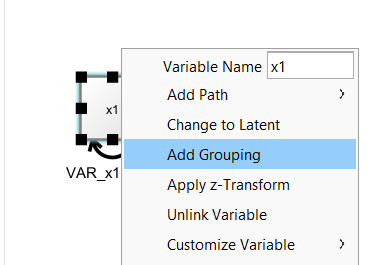
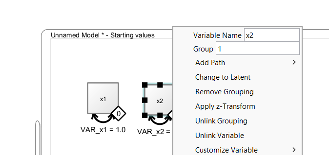
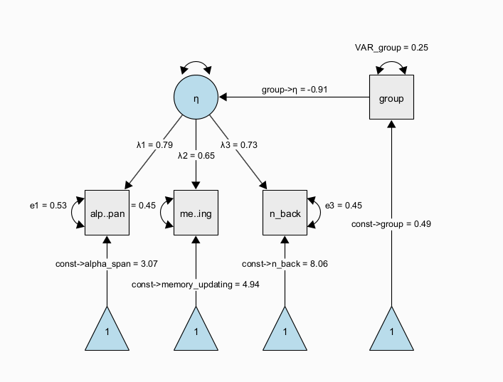
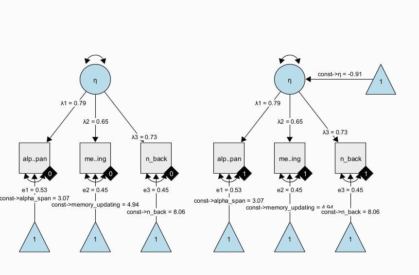

# Multi-Group Models

Onyx support multi-group models, in which we use a grouping variable that encodes group membership between individuals. Onyx has its own approach to multigroup modeling which works with filters on observed variables that filter out subsets of observations that should be modeled by a given observed variable.

By right-clicking on an observed variable, you can select "Add Grouping" to add a filter to one or more selected observed variables.

Then, a little diamond grouping indicator appears on that variable. The value inside the diamond reflects the group membership. To change group membership, right-click the diamong and change the "Group" value:

Latent Mean Differences

The diamonds are variable containers, that is, you can drag a discrete-valued grouping variable from a dataset on to the diamond. 
As long as the diamond is not filled (white fill color), it is not connected. Once it is connected, it becomes filled (black color), that is, it is now associated with a grouping variable in the dataset.
 
# Latent Means

Models of latent mean differences are like the classical t-test or ANOVA but estimated on latent constructs.

Figure 1 shows a path diagram representing one possibility to set up a latent mean difference model when there are multiple, noisy measurements of the same underlying latent construct. This model is a MIMIC [multiple-indicators multiple-causes, @hancock2001effect] model, in which we estimate a measurement model of a latent trait $\eta$ across two groups that are encoded via a dummy group indicator. The latent trait is measured through multiple observed indicators (here, $x1$ to $x3$) with indicator-specific residual variance terms, which allows to separate error variance from true-score variance. If correctly specified, this approach allows us to obtain more precise estimates of the latent trait purged of measurement error and unreliability [@deshon1998cautionary]. In this specific instance, the regression path from the dummy-coded group indicator to the latent variable directly represents a standardized mean difference because the scale of the latent variable was fixed to have a variance of one. Note that the MIMIC model assumes that measurement invariance holds, that is, the factor loadings, item intercepts, and item residual variances are assumed to be the same across groups.

A more flexible model specification is also possible; using a multiple-group factor model, we can estimate the same factor model in each group separately and empirically test whether measurement invariance holds; then, we can continue to test whether there is a difference in latent factor means across groups. This is also known as the SMM [structured means modeling; @hancock2001effect] approach:

Note that all parameters with the same name have identity constraints; in particular, this means that parameters with the same name are identical across groups. In the path diagram shown above, all parameters are identical across groups. This implements a very strong assumption of measurement invariance across groups and identity of magnitude of variance (= individual differences at the latent level) across groups. Again, this restricted version of the SMM model is identical to the above dummy-coded MIMIC approach. However, the SMM allows to also freely estimate parameters between groups and perform tests of whether some of the restrictions are supported by the data or not.

## Exercises

-   Load the dataset "factor_model_memory.csv"

-   Use the "Latent Means Model" wizard to create both the SMM and the MIMIC approach model to estimate models of latent mean differences

-   Freely estimate the latent variance in the second group of the SMM approach

-   Copy the SMM model and freely estimate the factor loadings across groups; run a likelihood ratio test between the models as a test of measurement invariance
