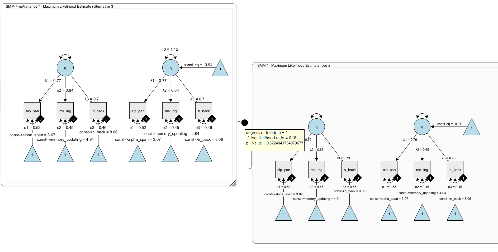
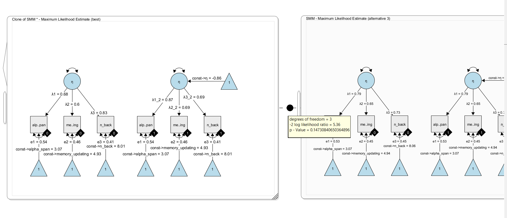

# Multi-Group Models

Multi-group models in Structural Equation Modeling (SEM) are an extension of standard SEM techniques that allow researchers to test whether relationships between variables are consistent or different across two or more groups. In the context of Psychology, these groups might represent categories such as gender, age cohorts, cultural backgrounds, or clinical vs. non-clinical populations. By estimating the same model simultaneously in multiple groups, researchers can formally assess measurement invariance (whether constructs are interpreted similarly across groups) and structural invariance (whether the relationships between constructs differ). This is especially valuable because it ensures that observed group differences reflect true psychological distinctions rather than artifacts of measurement bias. Overall, multi-group SEM provides a rigorous framework for comparing theoretical models across populations, strengthening the validity and generalizability of psychological findings.

## Multi-group models in Onyx

Onyx supports multi-group models, in which we use a grouping variable that encodes group membership between individuals. Onyx has its own approach to multigroup modeling which works with filters on observed variables that filter out subsets of observations that should be modeled by a given observed variable.

By right-clicking on an observed variable, you can select "Add Grouping" to add a filter to one or more selected observed variables.

Then, a little diamond grouping indicator appears on that variable. The value inside the diamond reflects the group membership. To change group membership, right-click the diamond and change the "Group" value:

## Connecting Grouping Indicators with Variables

The diamonds are variable containers, that is, you can drag a discrete-valued grouping variable from a dataset on to the diamond. As long as the diamond is not filled (white fill color), it is not connected. Once it is connected, it becomes filled (black color), that is, it is now associated with a grouping variable in the dataset. Model estimation can only start if all observed variables and all grouping indicators are connected with variables from a data view. To remove such a connection, right-click on the diamond and select "Unlink Grouping". To remove the entire group indicator, select "Remove Grouping" instead.

# Applied Example: Latent Mean Differences

Models of latent mean differences are like the classical t-test or ANOVA but estimated on latent constructs. The following paragraph is adapted from @brandmaier2025stop:

The next figure shows a path diagram representing one possibility to set up a latent mean difference model when there are multiple, noisy measurements of the same underlying latent construct. This model is a MIMIC [multiple-indicators multiple-causes, @hancock2001effect] model, in which we estimate a measurement model of a latent trait $\eta$ across two groups that are encoded via a dummy group indicator. The latent trait is measured through multiple observed indicators (here, $x1$ to $x3$) with indicator-specific residual variance terms, which allows to separate error variance from true-score variance. If correctly specified, this approach allows us to obtain more precise estimates of the latent trait purged of measurement error and unreliability [@deshon1998cautionary]. In this specific instance, the regression path from the dummy-coded group indicator to the latent variable directly represents a standardized mean difference because the scale of the latent variable was fixed to have a variance of one. Note that the MIMIC model assumes that measurement invariance holds, that is, the factor loadings, item intercepts, and item residual variances are assumed to be the same across groups.

A more flexible model specification is also possible; using a multiple-group factor model, we can estimate the same factor model in each group separately and empirically test differences across the groups. For example, we can test whether measurement invariance holds (is the measurement model the same across groups and thus: do the latent variables mean the same across groups?); then, we can continue to test whether there is a difference in latent factor means across groups. This is also known as the SMM [structured means modeling; @hancock2001effect] approach:

Note that all parameters with the same name have identity constraints; in particular, this means that parameters with the same name are identical across groups. In the path diagram shown above, all parameters are identical across groups. This implements a very strong assumption of measurement invariance across groups and identity of magnitude of variance (= individual differences at the latent level) across groups. Again, this restricted version of the SMM model is identical to the above dummy-coded MIMIC approach. However, the SMM allows to also freely estimate parameters between groups and perform tests of whether some of the restrictions are supported by the data or not.

## Exercises

-   Load the dataset "factor_model_memory.csv"

-   Use the "Latent Means Model" wizard to create both the SMM and the MIMIC approach model to estimate models of latent mean differences

-   Freely estimate the latent variance in the second group of the SMM approach7

-   Run a model comparison using a likelihood ratio test to test whether the latent variances significantly differ across groups.

-   What can you learn from the parameter estimates of the model?

-   Copy the SMM model and freely estimate the factor loadings across groups (by giving all factor loadings unique names); run a likelihood ratio test between the models as a heuristic test of weak measurement invariance (note that the classic approach starts with a model, in which all parameters are free across groups and then adds restrictions to different parts of the measurement model)

## Solution

Using the wizard, we create a SMM model with observed variable names matching the data set. Either enter the variable names manually in the wizard; or, leave the generic names x1 to x3 and later drag and drop the variables from the data view on to the observed variables in the model. This will automatically rename and connect the variables in the model to the respective variables in the data set. Clone the model (right-click on the model and select 'Edit -\> Clone model'). Right-click the data view and select "Send Data to Model" to connect all variables of the cloned model with the data set to start estimation. Now, add a model comparison between the two models (press right-mouse button on one model and drag the comparator edge on to the other model):

Here, we get a non-significant difference. The added free parameter does not significantly fit better. That is, there is no evidence for a difference in latent variances. As a result, we keep the simpler model (with fixed variance).

Now, clone the model once more and remove the constraint that the factor loadings are identical across groups. To do so, simply give the factor loadings in one model unique names. For example rename $\lambda_1$ to $\lambda_1\_2$ and $\lambda_2$ to $\lambda_2\_2$ and $\lambda_3$ to $\lambda_3\_2$ . Now the model has three more free parameters and estimates the factor loadings separately per group. Using a likelihood ratio test, we can compare both nested models. Under H0, both models fit equally well; under H1, the more complex model fits the data better.

Here, we find no significant difference in model fit, ie. there is no evidence that the factor loadings should be freely estimated across groups. In other words, there is no evidence for differences in the factor loadings. We conclude for now that weak measurement invariance holds in this model (but note that a significance-based approach is not necessarily the best approach for this decisions; others have recommended to look at effect size metrics for this).

## References
