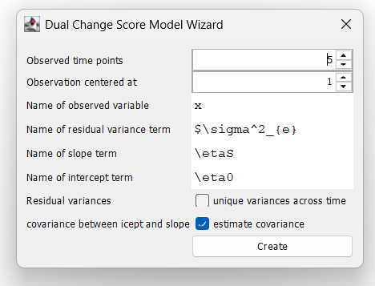
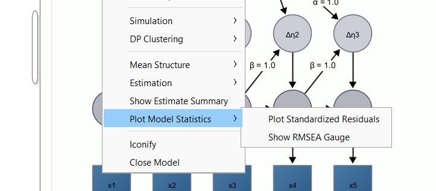
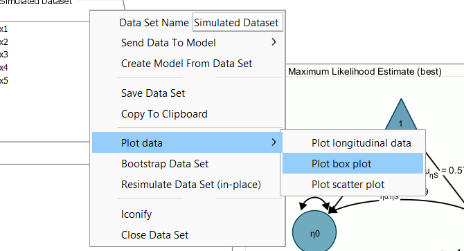
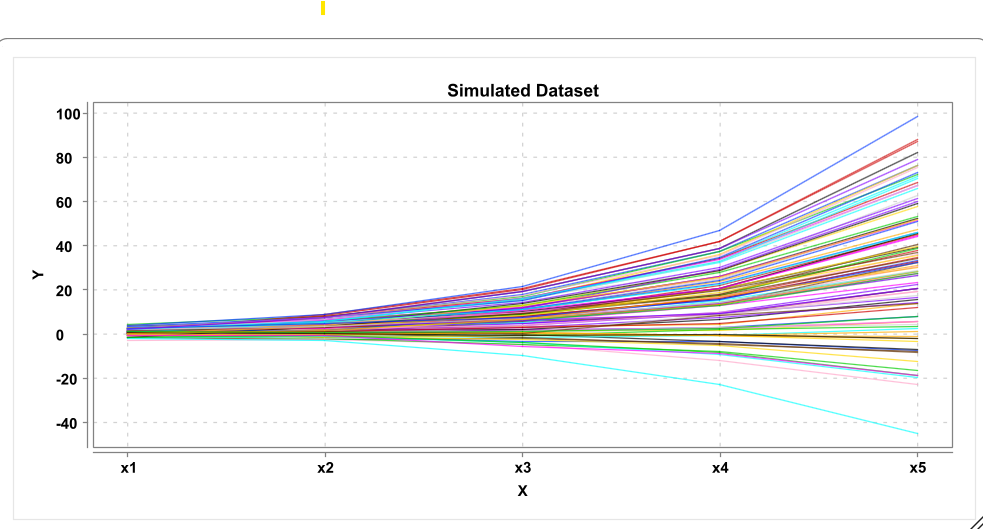
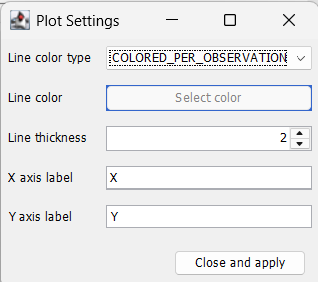

# Simulate and Plot

::: callout
Goal: Learn about simulation and plotting of data
:::

## Simulation to Understand Model Parameters

We want to answer this question:

In a Dual Change Score Model, what effects do parameters have on the model-implied trajectories?

Steps:

1.  Create a Dual Change Score Model

2.  Simulate Longitudinal Data

3.  Plot Longitudinal Data

4.  Change Model (Population) Parameters and Repeat from 2

## Dual Change Score Model

Use the DCSM-Wizard to create a dual change score model. Keep all values at their defaults. This creates a model with five time points and the observed time points will be called x1, x2, ..., x5.

## Simulation

## Plot

Next, right-click on the simulated dataset, choose "Plot data" and select "Plot longitudinal data".

## Longitudinal Plot

## Customize the Longitudinal Plot

Right-click on the longitudinal plot window. This will show some basic plot settings. Try out different ways to customize the plot. By default, the line color is selected as "COLORED_PER_OBSERVATION" such that each observation gets a different color. Alternatively, you can set the color to "USER DEFINED" and then pick a line color. You can also change the line thickness, and the axes labels

Click "close and apply" to apply the settings and close the dialog window. Right-click again and choose "save PNG" to save the graph as image file.

## Plot subsets of variables

If no variables are selected in the dataset, the longitudinal plot will be plotted across all variables in the dataset (in the order, in which they appear in the dataset). If you want to plot only across a subset of variables, select those variables in the variable list (e.g., by holding CTRL or CMD down and select the respective variables) and then click "Plot Data -\> Plot longitudinal data".

## Exercise

With the dual change score model (which you created using the wizard), ...
