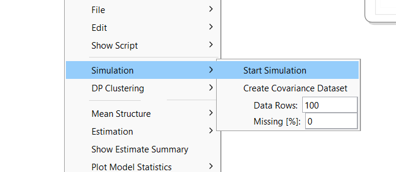
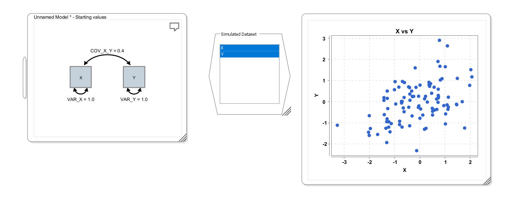

# Simulation and Plotting

Onyx offers facilities to simulate data from models and visualize both empirical and simulated data in plots. Both features can be used for model checking. For example, you can check whether data simulated from a model follow a pattern that is similarly expected to arise in your study. Or, you can use simulation and plotting of simulation results to investigate the effect of changes in parameters on model-implied outcomes.

## Simulation

To simulate data from a model, right-click on the model view, choose "Simulation -\> Start Simulation". This takes the model-implied covariance matrix and means vectors and simulates data from a multivariate normal distribution given these as population covariance matrix and means vector. By default, Onyx simulated 100 observations; the number can be changed in the context menu in "Data Rows"; you can also simulate missing data using a missing completely at random mechanism. By default, the simulated data are fully observed.

A simulated dataset will have variables corresponding to each observed variable in the model. By selecting the variables in the (simulated) data view and right-clicking on "Plot Data", you have a choice of different plotting options. The following screenshots illustrates a simple workflow, in which first a bivariate model is specified with a covariance of 0.4 (which happens to be identical to the correlation because both variances are 1.0). Then a dataset is simulated (shown in the middle of the screen); and finally, a scatter plot is generated from the simulated data set (right):

## An applied example: The dual change score model

The dual change score model (DCSM) is a powerful framework within structural equation modeling (SEM) for analyzing longitudinal data by explicitly modeling how individuals change over time. Unlike traditional growth models that describe trajectories with fixed slopes, the DCSM decomposes change into two components: a growth-curve type of change ($\beta$), and an additional dynamic component that captures proportional change, ie., how change at one time point influences subsequent change ($\alpha$). Residual error variance ($\sigma^2_{\epsilon}$) captures misfit and measurement error. Individual differences at beginning of the study are captured by a latent intercept $\eta_0$, and the growth curve changes are captured by a latent slope factor ($\eta_S$). This allows researchers to examine both stability and self-regulating processes within a construct, as well as potential coupling effects between multiple variables over time. By integrating features of latent growth curve models and autoregressive models, the DCSM provides a flexible approach for testing theories about developmental processes, feedback mechanisms, and temporal dependencies in psychological, behavioral, and social data. The model looks like this:

## Simulation to Understand Model Parameters

In the remainder, we want to learn how Onyx simulation and plot features can be used. With these, we want to answer this question:

In a Dual Change Score Model, what effects do parameters have on the model-implied trajectories?

Steps:

1.  Create a Dual Change Score Model

2.  Simulate Longitudinal Data

3.  Plot Longitudinal Data

4.  Change Model (Population) Parameters and Repeat from 2

## Dual Change Score Model Wizard

Use the DCSM-Wizard (right-click on the empty desktop, then choose "Create new model" and then select "Create new DCSM") to create a dual change score model. Keep all values at their defaults. This creates a model with five time points and the observed time points will be called x1, x2, ..., x5.

## Simulate Plot

Choose "Simulation -\> Start Simulation". Next, right-click on the simulated dataset, choose "Plot data" and select "Plot longitudinal data".

## Longitudinal Plot

## Customize the Longitudinal Plot

Right-click on the longitudinal plot window. This will show some basic plot settings. Try out different ways to customize the plot. By default, the line color is selected as "COLORED_PER_OBSERVATION" such that each observation gets a different color. Alternatively, you can set the color to "USER DEFINED" and then pick a line color. You can also change the line thickness, and the axes labels

Click "close and apply" to apply the settings and close the dialog window. Right-click again and choose "save PNG" to save the graph as image file.

## Plot subsets of variables

If no variables are selected in the dataset, the longitudinal plot will be plotted across all variables in the dataset (in the order, in which they appear in the dataset). If you want to plot only across a subset of variables, select those variables in the variable list (e.g., by holding CTRL or CMD down and select the respective variables) and then click "Plot Data -\> Plot longitudinal data".

## Exercises

-   Create a dual change score model using the wizard

-   Simulate Data and plot the data (longitudinal plot)

-   Change Parameters of the model, resimulate and plot

-   What happens if the self-feedback (beta) is 1, 0, or -1? Why?

-   If you set the self-feedback to zero, what are the effects of changing alpha? What if you set different alphas (rename them to alpha1, alpha2,... first) for different time points?

-   By setting a form of constant positive change (alpha) and negative proportional change (beta), can you generate simulated learning curves that reach an asymptote?

## Solution

The self-feedback term beta implies a form of proportional growth if values are positive because change then depends on previous level. This by itself can reflect an exponential growth function. In combination with constant growth rates (alpha \> 0), negative proportional change can be used to model change that flattens after a while. Here is one possible solution:

And these are some simulated trajectories from the model (N=100):

